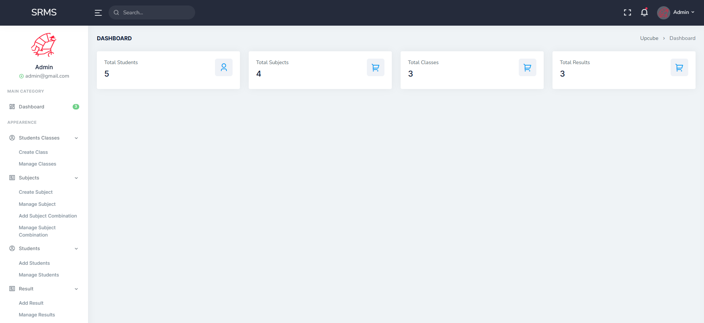
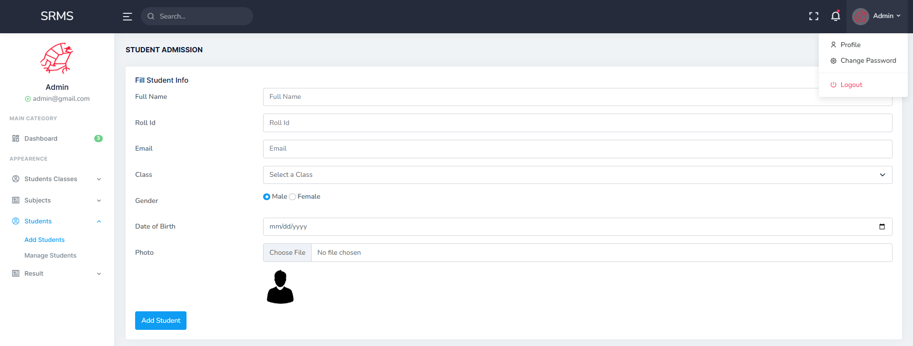
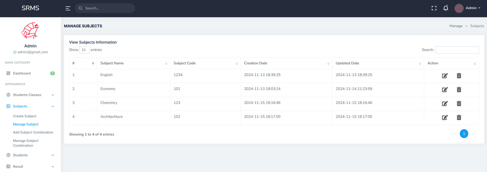
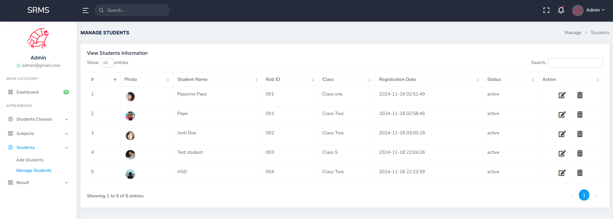
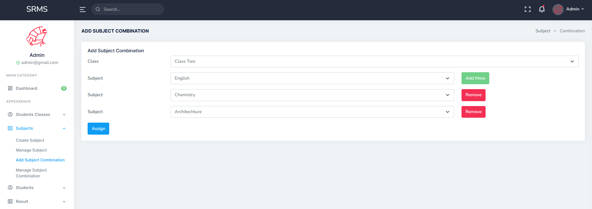
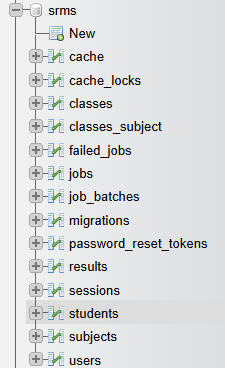

# Pablo Paez 🦝  - Student Result Management System 💻 - LARAVEL 11 RMS

 

  

# El Proyecto⭐ / The Project🌟

⭐ El proyecto es parte del portfolio de proyectos de LARAVEL, en esto caso un sistema de manejo de estudiantes/clases/materias/calificaciones/combinacion de materias etc. Cada dato esta vinculado a una base de datos donde estos pueden agregarse/modificarse/eliminarse y los cambios pueden verse en tiempo real por medio de la interfaz del sistema a la cual se accede por medio de un LOGIN de admin o de alumno
 
🌟 This project is part of a Laravel project portfolio, specifically designed as a Student Management System. It handles students/classes/subjects/grades/subject combinations. All data is stored in a database and can be added/modified/deleted. Changes are reflected in real-time via the systems interface, accessible through an admin or student login

  

### Tecnologias utilizadas: / Technologies used:

    - USER SESIONS
    - CRUD OPERATIONS
    - SESSION HANDLING
    - REAL-TIME APPLICATIONS WITH LIVEWIRE
    - COMPONENT-BASED ARCHITECTURE
    - STATE MANAGEMENT IN LIVEWIRE
    - EVENT HANDLING BETWEEN COMPONENTS
    - Advance JavaScript Uses
    - Image Upload System
    - Print Student Result
    - Breeze Package
<!-- LINKS -->
### Contacto📩 / Contact📩

Pablo Paez - Desarrollador Web - pablopaez2307@gmail.com

[![LinkedIn][linkedin-shield]][linkedin-url]

[linkedin-shield]: https://img.shields.io/badge/-LinkedIn-black.svg?style=for-the-badge&logo=linkedin&colorB=555
[linkedin-url]: https://www.linkedin.com/in/pablo-paez-t/
